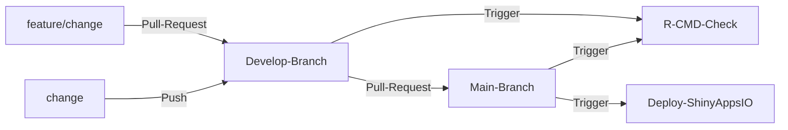

## PCAdash
#### Visualization of PCA-Metegenes using R-Shiny at single-cell resolution

    

---

### Introduction

`PCAdash` is an R-shiny application designed to visualize the results of PCA-Metagenes at single-cell resolution. The app follows a black theme and consists of two pages: the results page and the documentation page.

`PCAdash` is deployed on [shinyapps.io](https://www.shinyapps.io/) and AWS-EC2. Additionally, it is integrated with GitHub Actions for CI/CD, enabling automatic deployment on [shinyapps.io](https://www.shinyapps.io/) whenever a new commit is pushed to the `main` branch. The app also utilizes the R-CMD-Check workflow to ensure it is free from errors and warnings. Finally, the app is packaged within an R package named `PCAdash`.

---

### Motivation

I designed this application to present some of the work from my PhD project on PCA-Metagene inference and now it acts as one of my showcase project. Metagenes serve as summaries of gene sets (pathways) and illustrate the coordinated expression of genes within a particular set. This app was initially developed during the early years of my PhD program and later revamped to be more user-friendly and interactive. While most improvements focus on development and deployment, the introduction of a black theme is also a significant feature. Please refer to the documentation for more information about the app.

---

### CI/CD

---

 

---
