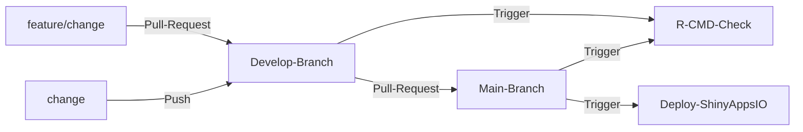

## PCAdash
#### Visualization of PCA-Metegenes using R-Shiny at single-cell resolution

    

---

### Introduction

`PCAdash` is an R-shiny application designed to visualize the results of PCA-Metagenes at single-cell resolution.

`PCAdash` is deployed on [shinyapps.io](https://www.shinyapps.io/). Additionally, it is integrated with GitHub Actions for CI/CD, enabling automatic deployment on [shinyapps.io](https://www.shinyapps.io/) whenever a new commit is pushed to the `main` branch. The app also utilizes the R-CMD-Check workflow to ensure it is free from errors and warnings. Finally, the app is packaged within an R package named `PCAdash`.

---

### Motivation

Cell fate decisions are pivotal in cellular development, differentiation, and disease progression. Traditional gene-centric trajectory inference tools often overlook the complexity of cellular functions, which are driven not just by individual genes but by coordinated interactions within pathways. Given the interconnected nature of these processes, it is essential to move beyond simple gene lists and assess how entire pathways evolve over Pseudotime. Our work introduces an innovative approach to capture these changes by representing pathway activity as Metagenes in Pseudotime. By leveraging both pathway and trajectory data, this approach evaluates how pathway activity fluctuates across Pseudotime, providing a more holistic view of cellular dynamics.

---

### CI/CD

---
